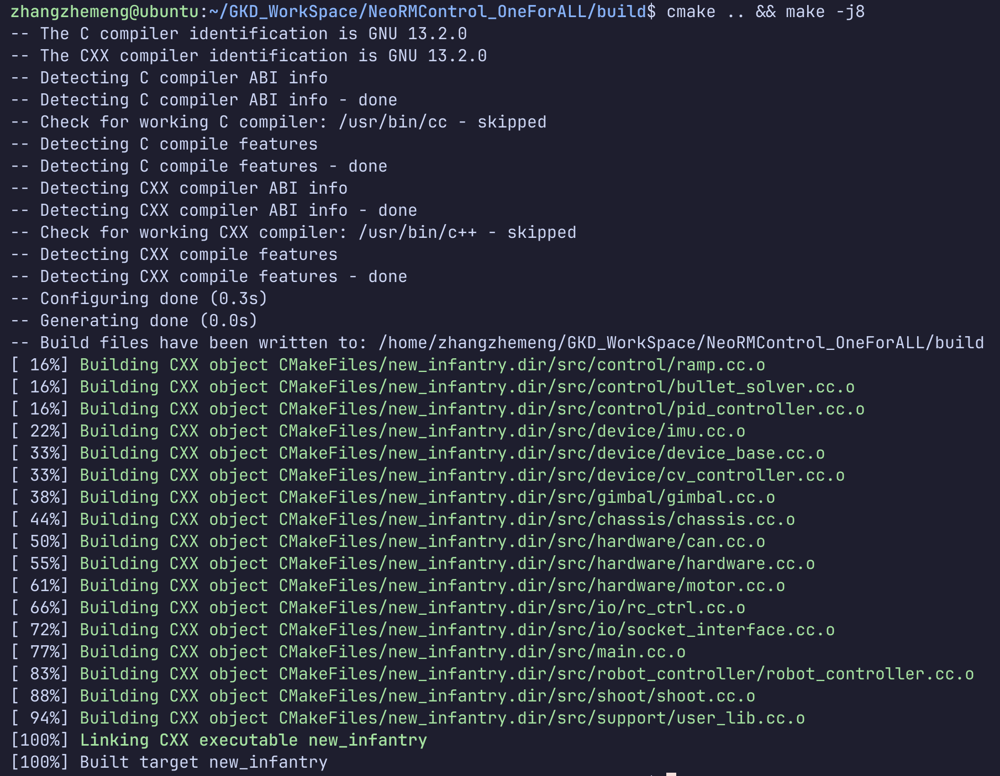
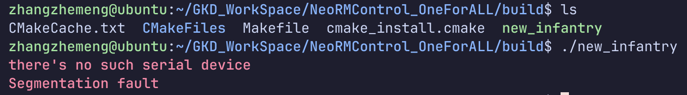

## 这里会教你如何编译运行我们的仓库
首先进入我们的工作空间
```
cd ~/GKD_WorkSpace
```
接着，你可以使用ssh来clone我们的仓库到本地
```
git clone git@github.com:zzLinus/NeoRMControl_OneForALL.git
```
进入本地代码仓库
```
cd NeoRMControl_OneForALL
```
创建一个文件夹用来存放我们编译出来的文件，并进入这个文件夹
```
mkdir build && cd build
```
在此文件夹内执行编译指令
```
cmake .. && make -j8
```
会得到如下图一样的结果，恭喜你成功编译了我们的代码

然后我们可以使用`ls`命令查看build文件夹内的内容，我们会发现了多了`new_infantry`,这便是我们编译出的二进制文件，同样我们可以运行它。像这样报错了，别紧张！这是因为我们的电脑并没有链接硬件设备



